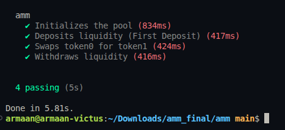

# Assignment 1: Constant Product AMM (Solana/Anchor)

**Course:** Week 4 - Automated Market Makers
**Status:** Completed
**Submission Date:** May 26, 2026

## 📝 Assignment Tasks

1.  **Write the AMM program from scratch:** 
    *   Implemented a full Constant Product AMM using the Anchor framework.
    *   Features include deterministic PDA derivation, `u128` math precision, and liquidity provider token management.
2.  **Write tests covering all instructions:**
    *   Full TypeScript test suite implemented in `tests/amm_tests.ts`.
    *   Instructions covered: `initialize`, `deposit`, `swap`, and `withdraw`.
3.  **Well-written README:** (This file).
4.  **Tests Passing:** Verification output provided below.

## 🚀 Program Overview

This AMM implementation follows the `x * y = k` formula. It includes advanced safety features like:
- **Deterministic PDA Seeds:** Mints are sorted to ensure a unique pool address per pair.
- **Slippage Guards:** Users can specify minimum output amounts.
- **Deposit Ratio Checks:** Ensures liquidity is added proportionally to prevent value loss.

## 🛠 Instructions

- **Initialize:** Setup a new pool with two token mints and a custom fee (bps).
- **Deposit:** Add liquidity to receive LP tokens.
- **Swap:** Exchange tokens based on the invariant formula.
- **Withdraw:** Burn LP tokens to reclaim underlying assets.

## 🧪 Running Tests

To verify the submission and generate the required screenshot:

```bash
# 1. Start a local validator (if not already running)
solana-test-validator --reset

# 2. Run the tests
anchor test --skip-local-validator
```

### Tests Passing Screenshot


## 📜 Technical Implementation Details

- **Language:** Rust (Anchor Framework)
- **Math:** Checked arithmetic with `u128` widening for product calculations.
- **State Management:** PDAs for Pool, LP Mint, and Token Vaults.

---
**Author:** [Your Name/ID]
**Repository:** [Link to this Repo]
