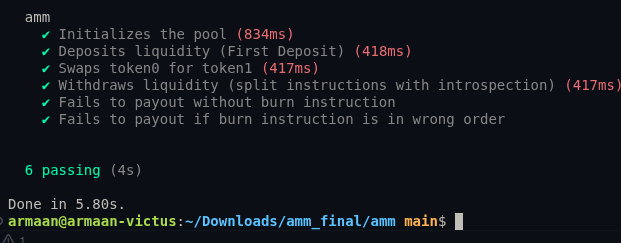

# AMM with Instruction Introspection Challenge

This project implements a Constant Product Automated Market Maker (AMM) on Solana using the Anchor framework. It specifically addresses the Week 6 challenge to use **instruction introspection** to verify a token burn before a token payout in separate instructions.

## Challenge Overview

The goal was to:
1. Write an AMM from scratch.
2. Separate the `withdraw` logic into two distinct instructions: `burn_lp_tokens` and `payout`.
3. Use **instruction introspection** (via the `Instructions` sysvar) in the `payout` instruction to verify that a valid `burn_lp_tokens` instruction occurred in the same transaction immediately before it.

## Implementation Details

### 1. Separate Instructions
The withdrawal process is split into two program instructions:
- `burn_lp`: Burns the user's LP tokens and records the amount in the instruction data.
- `payout`: Verifies the burn and transfers the proportional share of pool reserves to the user.

### 2. Instruction Introspection
In the `payout` instruction, we use the `Instructions` sysvar to inspect the transaction's instruction list:
- We load the current instruction index.
- We fetch the previous instruction (`index - 1`).
- We verify:
    - The `program_id` matches our program.
    - The instruction discriminator matches `burn_lp`.
    - The `lp_amount` is extracted from the previous instruction's data.
    - The `user` and `pool` accounts match the current context to prevent spoofing.

### 3. Safety & Atomicity
By using introspection, we ensure that:
- Users cannot call `payout` without first burning tokens.
- The `payout` amount is strictly tied to the amount burned in the preceding instruction.
- The entire process is atomic within a single Solana transaction.

## Project Structure
- `programs/amm/src/instructions/burn_lp.rs`: Implementation of the LP token burn.
- `programs/amm/src/instructions/payout.rs`: Implementation of the payout with introspection logic.
- `programs/amm/src/lib.rs`: Program entry points.
- `tests/amm_tests.ts`: Comprehensive test suite covering initialization, deposit, swap, and the split withdrawal process (including failure cases).

## Getting Started

### Prerequisites
- Solana Tool Suite
- Anchor Framework
- Node.js & Yarn

### Installation
```bash
cd amm
yarn install
```

### Running Tests
```bash
anchor test
```

## Test Results
All 6 tests passed successfully, including:
- Initializing the pool
- Depositing liquidity
- Swapping tokens
- Withdrawing liquidity via split instructions
- Failure case: Payout without burn
- Failure case: Payout with burn in wrong order

## Screenshot


